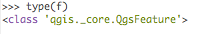
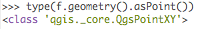
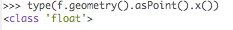
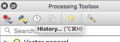
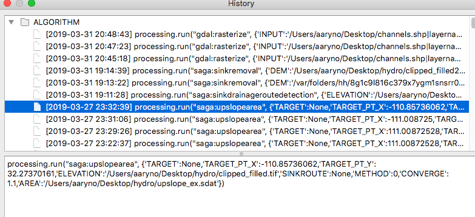
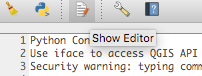

# Assignment: Watershed Delineation Part II (Scripting)
## Worth: 40 points
## Due: Sunday, April 7, 11:59pm

## Assignment

### Obective: Identify the 10 watersheds with the largest area that cross River Road

In the previous lab you delineated and calculated the area of a watershed from the point of an intersection of River Road 
and a channel derived from a USGS DEM you downloaded from the National Map. However, you don't just need to know the 
location and area of a single watershed; you need to know the locations and areas of the 10 largest watersheds whose 
channels cross River Road. Doing it by hand is tedious and error-prone. Building a script to extract the coordinates
from the intersections and plugging them into the `Upslope Area` tool would be more accurate and more efficient. 

You will build and run a python script that automatically does everything you performed manually for the one watershed. 
I understand that you are not proficient with Python and not familiar with the QGIS python libraries so I will walk
you through the more complicates aspects of the script in a manner similar to how you might try to build a script like
this on your own.

First, you will identify all the tasks the script needs to be able to perform:
1) Loop through all the features in the `intersections` layer. 

For each feature:

2) Build an `upslope area` grid

We will add a bit more in Part 3 but for now we will just create the `upslope area` grid.

That is the general algorithm for what you need to do. However, you shouldn't just write the python script to do it
in one go; you should slowly build and test the script to ensure it is doing what you want it to.

### Background reading
This doc shows how you can iterate over all the features in a layer:
https://docs.qgis.org/3.4/en/docs/pyqgis_developer_cookbook/vector.html#iterating-over-vector-layer

This tutorial shows how you can iterate over all the features in a points layer and print the x and y coordinate values. 
http://www.qgistutorials.com/en/docs/3/getting_started_with_pyqgis.html

Read https://realpython.com/python-string-formatting/#2-new-style-string-formatting-strformat for instructions and best practices about how to format strings containing variable values.

#### First
Write a script that loops through all the features. This is pretty easy and you've already done it in the previous
lab for a selected layer. In this case, you will load a layer from its location on
the file system. Use https://docs.qgis.org/testing/en/docs/pyqgis_developer_cookbook/loadlayer.html as a starting point. 

Although the next step in our algorithm is to run some `saga` processing,
let's not jump right into that. Instead, print out some attributes of the features just to reassure ourselves that
it is doing what we want.

```
for f in layer.getFeatures():
    print("{a:d} {b:10.10f} {c:10.8f}".format(a=f.id(),b=f.geometry().asPoint().x(),c=f.geometry().asPoint().y())
```
I know that looks a little complicated. There a few different ways to format strings that contain numeric variables. See 
https://realpython.com/python-string-formatting/#2-new-style-string-formatting-strformat for a review of how this works.
In our example, there are really just two parts that are important to point out here. First, that we are printing the
feature's ID, aka `f.id`. Second, that we are printing up the coordinates, aka `f.geometry().asPoint().x()`.

If the second function looks exotic or unfamiliar to you, read the Python tutorial on Classes: https://docs.python.org/3/tutorial/classes.html. 
What is happening is the feature (you can type `type(f)` to see what type or class a variable is:



The feature is a class `core.QgsFeature`, which has members and methods. One of the methods (aka `functions`, but when they 
belong to a class they are called `methods`). 


Keep going the rabbit hole for that set of function calls:



And



Which is a type `class 'float'`, or a number. We saw a similar example in the QGIS tutorial.

Printing out the coordinates of each feature is a good proof of concept to prove to yourself that you have access to
the `x,y` coordinates and can use them in the `upslope_area` tool.

Once you start doing processing on each of the features QGIS will freeze as it focuses all its processing on the
Python script. While you are building and debugging it would be a good idea to only perform processing on one or two
test features. Use the `break` statement to break out the `for f in layer.getFeatures()` loop. You can find tutorial on 
`break` here: https://docs.python.org/3.7/tutorial/controlflow.html#break-and-continue-statements-and-else-clauses-on-loops. 

Once you have been able to run the script from start to finish on one or two features, come back and remove the `break`
statement so you can run the script on all the features.

#### Second
The `upslope_area` functions sounds a little daunting. Before when you ran it, you just selected the tool from the
SAGA menu, Selected all the inputs, specified the output, and clicked the botton. It doesn't seem straightforward
how that function could run from Python. What is the name of the function? What are the arguments? You may find
some documentaion on the tool to help you: https://docs.qgis.org/3.4/en/docs/user_manual/processing_algs/saga/terrain_analysis_hydrology.html#upslope-area.

Even with the documentation it can be a little daunting. However, you can get a great jump start by looking at your
Processing History and copying the usage from the time you ran it previously (or run it again with the parameters you want). Just click on the `History` icon at the top of the `Processing Toolbox`:



You'll get your History in a separate Window. Find the whole command:



That's a great start but you need to replace all the values you used previously with values specific to each intersection
point.

To make things easier, note that long python commands can be wrapped over multiple lines if the end of the line contains a
a space and a backslash, like this: ` \`. Note that the slash _must_ be the very last character on the line.

In my example, I would start with this:

```
processing.run("saga:upslopearea", {'TARGET':None,'TARGET_PT_X':-110.85736062,'TARGET_PT_Y':32.27370161,'ELEVATION':'/Users/aaryno/Desktop/hydro/clipped_filled.tif','SINKROUTE':None,'METHOD':0,'CONVERGE':1.1,'AREA':'/Users/aaryno/Desktop/hydro/upslope_ex.sdat'})
```

and re-format it like this:
```
processing.run("saga:upslopearea", { \
  'TARGET':None, \
  'TARGET_PT_X':-110.85736062, \
  'TARGET_PT_Y':32.27370161, \
  'ELEVATION':'/Users/aaryno/Desktop/hydro/clipped_filled.tif', \
  'SINKROUTE':None,'METHOD':0, \
  'CONVERGE':1.1, \
  'AREA':'/Users/aaryno/Desktop/hydro/upslope_ex.sdat'}) 
```

It's the exact same command but easier to read. It is clearly a `dict` containing the arguments and argument values for the
`saga:upslopearea` tool.

The second thing to do with this is to replace the x and y coordinates with the coordinates derived from your intersection 
features:
```
processing.run("saga:upslopearea", \
  {'TARGET':None,\
  'TARGET_PT_X':f.geometry().asPoint().x():\
  'TARGET_PT_Y':f.geometry().asPoint().y(),\
  'ELEVATION':'/Users/aaryno/Desktop/hydro/clipped_filled.tif',\
  'SINKROUTE':None,\
  'METHOD':0,\
  'CONVERGE':1.1,\
  'AREA':'/Users/aaryno/Desktop/hydro/upslope_ex.sdat'}) 
```   

We are close to being done here. The remaining issue is that the output (`AREA`) will be the same for every intersection. 
If there are 50 features in intersection, this script would write the same output file 50 times, overwriting the previous
output 49 times. Use the feature's primary ID `f.id()` in the output filename to make it unique to each feature. I'll
leave that to you to figure out.

Another suggestion is to sprinkle your code with `print` statements explaining what you are working on. This will help 
understand the timing while it is running as well as diagnose problems if they come up.

### Recommendations for working with the Python Console

A note on using the Python Console in QGIS: When you first open the Python Console, click on the 
 icon to open the editor. Your Python console will be accompanied by an 
editor and will look like this:


While you _can_ type in the python console, if you attempt to do anything with much complexity at all it will be
very cumbersome and prone to syntax errors. Instead, you should put your python code in the editor and, when you are 
ready to run a block of code, click the "Run Script" button, which looks like a green triangle: 
.

I recommend taking it one step further and create/edit/save your Python from an external editor like `Notepad++` 
(Windows) or `Sublime` or `Atom` (OSX). If your script hangs QGIS and you have to close QGIS or if it crashes, you 
will may your work if you are using the Python Editor. Write and edit your Python in the external editor, then use
`Copy`/`Paste` to paste the relevant code into the Python Editor, then use the `Run` button (green triangle) to run the
script in the QGIS Python Console.

To add more debugging information, you may want to look at the Log Messages by clicking:  `View` -> `Panels` -> `Log Messages`

### Deliverable

1. Create a python script named `river_watersheds.py` that creates an `upslopearea` grid for all features in the `intersections.shp` class you created in Part 1. Save the script in a new github branch named `watershed`

2. Add two screenshots of any two `upslope_area` grids and name them `screenshots/upslopearea1.png` and  `screenshots/upslopearea2.png`
